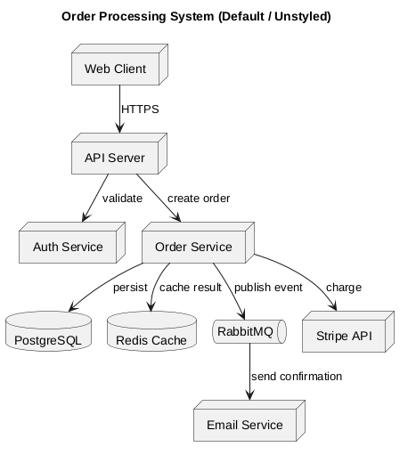
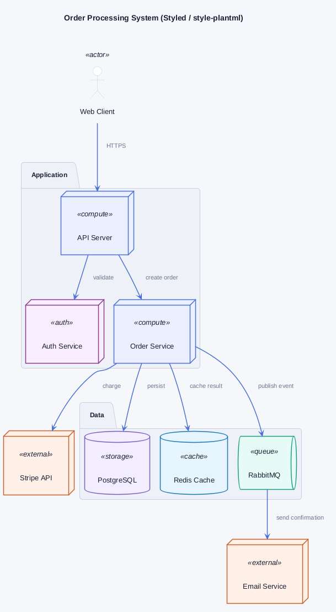
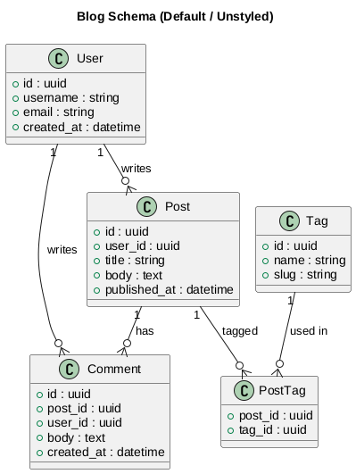
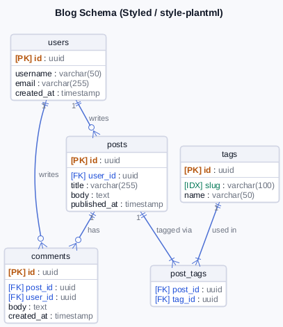
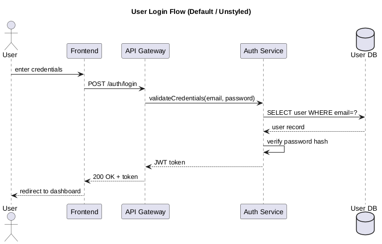
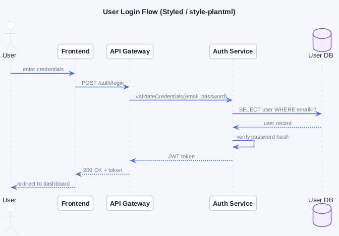

<div align="center">

<!-- GitHub Status Badges -->


<br/>

<!-- Technology Badges -->


  <h3>style-plantml</h3>
  Figma-inspired styling and clean component tokens for modern PlantUML diagrams.
</div>

<div align="center">
  <strong>English</strong> • <a href="README.pt.md">Português</a>
</div>

---

# 📖 About
**style-plantml** provides clean, modern, Figma-inspired themes for PlantUML diagrams. It brings contemporary visual design (subtle palettes, distinct category colors, rounded borders, clean table headers, and optional Font Awesome 5 icons) to Architecture, Entity-Relationship (Database), and Sequence diagrams.

# ⚡ Visual Comparison (Before vs After)

### Architecture Diagram
| Default PlantUML (Unstyled) | style-plantml (Styled) |
|:---:|:---:|
|  |  |

### Relational Database / ER Diagram
| Default PlantUML (Unstyled) | style-plantml (Styled) |
|:---:|:---:|
|  |  |

### Sequence Diagram
| Default PlantUML (Unstyled) | style-plantml (Styled) |
|:---:|:---:|
|  |  |

# 💻 Getting Started

### Requirements
- [Java OpenJDK](https://openjdk.org/) (>= 11)
- [PlantUML](https://plantuml.com/download) (>= 1.2024.x)
- [Graphviz](https://graphviz.org/download/) *(Optional — Smetana internal layout engine is pre-configured)*

### Installation & Usage

#### Option A: Local Include
Clone the repository:
```sh
git clone https://github.com/bgluis/style-plantml.git
```

Include the desired theme:
```plantuml
@startuml
!include path/to/style-plantml/themes/light/architecture.puml

SVC_ACTOR(user, "User")
SVC_COMPUTE(api, "API Service")
user --> api
@enduml
```

#### Option B: Direct GitHub URL
```plantuml
@startuml
!define STYLE_PLANTML https://raw.githubusercontent.com/bgluis/style-plantml/main
!include STYLE_PLANTML/themes/light/architecture.puml

SVC_ACTOR(user, "User")
SVC_COMPUTE(api, "API Service")
user --> api
@enduml
```

### Toggle Sprites (Icons)
Sprites are enabled by default. To remove icons, add `!define HIDE_SPRITES` **before** the `!include`:
```plantuml
!define HIDE_SPRITES
!include ../themes/light/architecture.puml
```

---

# 🤝 Contributors
<a href="https://github.com/bgluis/style-plantml/graphs/contributors">
  
</a>
